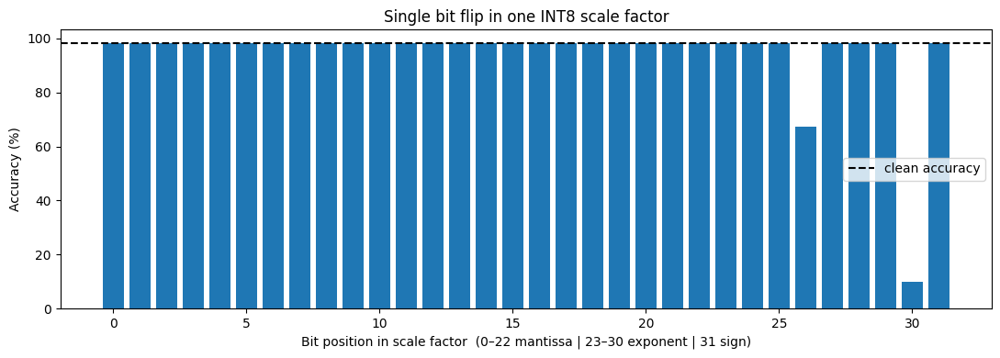
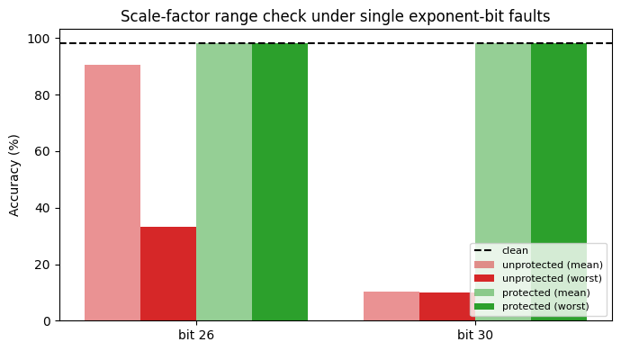

# Fault Sensitivity of INT8 Scale Factors in a Quantized Vision Transformer

**A single bit flip in one INT8 scale factor can collapse a Vision Transformer's accuracy from 98.3% to random-guess level. A per-layer range check on the scale factors restores it to 98.2% at negligible cost.**

## Motivation

Quantization is one of the most common ways to deploy Transformers efficiently on resource-constrained hardware. INT8 weight quantization stores each weight as a small integer, plus a floating-point **scale factor** that maps the integers back to real values. This saves memory (4× here), but it also introduces new auxiliary data whose reliability is rarely studied.

This project asks a simple question: **how sensitive is a quantized Transformer to hardware faults (bit flips) in its scale factors, compared with its integer weights, and can a lightweight check protect against them?**

## Setup

| Item | Details |
|---|---|
| Model | ViT-Base/16 (224×224), pre-trained on ImageNet-21k and fine-tuned on CIFAR-10 (`aaraki/vit-base-patch16-224-in21k-finetuned-cifar10`), 85.8M parameters |
| Data | Fixed random subset of 1,000 CIFAR-10 test images (seed 0) |
| Quantization | Weight-only, symmetric, per-output-channel INT8 for all 73 `Linear` layers; activations kept in FP32 |
| Fault model | Single transient bit flip in stored model parameters, injected in software; one fault per trial, restored after each evaluation |
| Hardware | Google Colab, NVIDIA Tesla T4 |

**Quantization baseline**

| | FP32 | INT8 |
|---|---|---|
| Accuracy | 98.30% | 98.30% |
| Linear-layer weight memory | 339.8 MB | 85.3 MB |

INT8 quantization costs no accuracy on this model. The quantized model stores about **85 million INT8 weights** but only about **83,000 FP32 scale factors** (one per output neuron).

## Experiments and results

### 1. INT8 weights vs. scale factors

The most damaging bit was flipped in a random INT8 weight (bit 7) or a random scale factor (bit 30, the highest exponent bit). The test used 10 trials per configuration, separately for attention and MLP layers.

| Fault target | Group | Mean accuracy | NaN outputs |
|---|---|---|---|
| INT8 weight, bit 7 | attention | 98.30% | 0% |
| INT8 weight, bit 7 | MLP | 98.30% | 0% |
| Scale factor, bit 30 | attention | 10.03% | 100% |
| Scale factor, bit 30 | MLP | 10.00% | 100% |

A single INT8 weight fault has no measurable effect, because INT8 bounds the damage to at most 128 quantization steps in one weight. A single scale-factor fault reduces the model to random guessing (10% on 10 classes), because it corrupts every weight in that row at once and the resulting overflow propagates through the network as NaN.

### 2. Bit-position sweep over scale factors

Each of the 32 bits of a scale factor was flipped (3 trials per bit).

- **Mantissa bits (0–22) and the sign bit (31):** no effect.
- **Most exponent bits (23–25, 27–29):** negligible effect (≥ 98.23%). Bit 29 shrinks the scale to almost zero, which effectively silences one neuron, and the model tolerates this.
- **Bit 26:** mean 67.27%, worst trial **11.4%, with no NaN**. This is **silent data corruption**: the outputs look normal but are wrong, so a NaN check would not detect it.
- **Bit 30:** always 10.0%, with 100% NaN outputs. This is a detectable failure.

There is a clear **asymmetry**. Faults that make a scale smaller are harmless, while faults that make it much larger are catastrophic. Whether a given exponent bit increases or decreases the scale depends on that bit's original value, which explains why bit 26 harms some rows but not others.

### 3. Lightweight protection: per-layer scale range check

Before deployment, the maximum scale factor of each layer is recorded (73 values in total). At inference, any scale above its layer's recorded maximum is clamped to it. Because of the asymmetry above, only an upper bound is needed.

Each fault was evaluated with and without protection (10 trials per bit).

| Bit | Unprotected (mean / worst) | Protected (mean / worst) |
|---|---|---|
| 26 (silent corruption) | 90.48% / 33.3% | 98.28% / 98.2% |
| 30 (NaN failure) | 10.27% / 10.0% | 98.29% / 98.2% |

**Overhead:** 73 stored values and one clamp per layer. Clean accuracy is unchanged (98.30%), and inference time shows no measurable change.

**Why it catches every harmful fault in this model:** within any layer, the largest scale is at most 32× the smallest (median 4×). The harmful flips multiply a scale by at least 256×, so even the smallest scale in a layer is pushed above the layer's cap after such a flip. The faults that can stay under the cap (×2 to ×16, bits 23–25) were shown in Experiment 2 to be harmless.

## Limitations

- **Scope:** one model (ViT-Base), one dataset, and weight-only quantization. Activations, KV caches, and accelerator control paths were not quantized or targeted.
- **Fault model:** single, transient bit flips injected in software. This does not model physical fault mechanisms, multi-bit upsets, or adversarial fault attacks such as targeted bit-flip attacks.
- **Statistics:** a small number of trials (3–10 per configuration) on 1,000 test images.
- **Protection:** clamping limits damage but does not restore the original value. The range check also assumes the stored caps themselves are fault-free.
- **Generality:** the 32× scale spread is a property of this model. Models with a wider within-layer spread may let harmful faults slip under a per-layer cap.

## Future work

- Extend to full INT8 (weights + activations), lower precisions (INT4), and other quantization schemes (per-group, asymmetric with zero-points).
- Study other auxiliary structures of efficient inference: zero-points, sparsity indices, and KV-cache compression metadata.
- Evaluate on LLMs and vision-language models, and on real accelerator platforms (GPU, FPGA).
- Compare range checks with other lightweight protections (e.g., duplicated or parity-protected scales) under adversarial rather than random faults.
- Test whether predictive uncertainty (e.g., Monte Carlo Dropout) can flag silent corruption that range checks miss.

## Reproducing

Open the notebook in Google Colab with a GPU runtime and run the cells in order. All randomness is seeded. Raw results are in `scale_bit_sweep.csv` and `protection_results.csv`.

## Author

Mubashar Abbas, MS Data Science (NUST, 2026). Research interests: reliable, interpretable, and efficient deep learning.